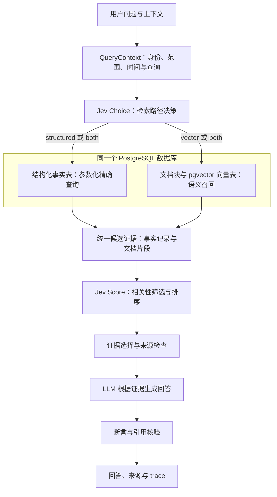
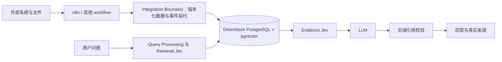

# 下一版本交付计划：单库 PostgreSQL + pgvector + Jev

更新日期：2026-10-02。当前设计以仓库根目录的 [OrionStack — DB + Vector + JEV 检索架构设计.md](<../../OrionStack — DB + Vector + JEV 检索架构设计.md>) 为准。本文补充现状评估、实现边界与交付目标。M1 schema、迁移和客户端已实现，现有问答尚未切换；运行与联调入口见 [M1 说明](5_core_foundation_runbook.md)。

## 1. 已确认的目标

- 只使用一个 PostgreSQL 数据库。结构化事实表与 pgvector 向量表共用数据库连接和来源目录，可以用不同 schema 管理。
- Jev 是 TypeSafe 已有的模型服务，承担检索路径选择与候选证据相关性判断。
- 检索路径为 `structured`、`vector`、`both`。两路结果转换成统一证据对象后合并。
- LLM 根据筛选后的证据生成回答，输出可追溯并经过检查的来源。
- n8n / workflow 只在检索链之外工作，通过稳定 Integration Boundary 接收业务动作并提交数据和状态事件；用户提问不触发 workflow。
- Elasticsearch 不进入下一版本的开发与验收范围。本轮新增的 ES 同步、筛选与专项测试已撤回。



图中结构化查询和向量查询是访问同一个数据库的两条路径。`both` 由应用执行两条查询并合并结果，不增加第三个数据库。

## 2. Jev 调研结论

Jev 接收 `state` 和预定义的 typed questions，返回 `Choice`、`Score` 或 `Noul`。其中 Choice 适合路径选择，Score 适合按明确标准评分；它不承担回答文本、SQL 或向量的生成。[TypeSafe 官方介绍](https://docs.typesafe.ai/introduction)

官方接口是 `POST https://api.typesafe.ai/v1/systemone`，使用 Bearer API key。请求含 `model`、`state` 和 `questions`，响应提供实际模型版本、对应答案和 token 用量。接入层应校验答案类型与范围，并记录实际版本。[官方 API](https://docs.typesafe.ai/api)

当前官方列出的固定模型是 `jev-1.13.0`；`jev-latest` 会随版本变化。英语是主要训练语言，中文任务需用本项目数据评估。发布验收固定模型版本，避免阈值随别名变化。[模型与语言说明](https://docs.typesafe.ai/models)

官方分别提供了 [RAG 片段分类](https://docs.typesafe.ai/cookbooks/classifying_rag_passages) 和 [引用核验](https://docs.typesafe.ai/cookbooks/citation_check) 示例，支持图中相关性判断与回答后的来源检查。实际质量、延迟和成本仍需项目实验确定。

## 3. 现状评估与复用边界

| 当前模块 | 可复用的能力 | 与目标的差距 |
| --- | --- | --- |
| `ChatService`、API、前端 | 提问入口、登录、文档上传、反馈、trace_id | 当前回答主链仍以单条命中和模板回答为主；需拆出检索编排与证据生成 |
| `DynamicQueryService`、`SystemAdapter` | 可参考 principal、租户与 scope 的约束 | 旧“匹配→识别系统→调接口”链路退役；核心事实查询直接访问 PostgreSQL，外部连接交给 workflow |
| `DocumentParser`、`ChunkService` | TXT/MD/PDF/DOCX 解析与切块 | 缺少 PostgreSQL 入库、embedding 任务和向量版本管理 |
| `KnowledgeUnitRepository`、SourceRecord | 来源、生命周期、版本与抽取发布概念 | JSONL 持久化需迁移；两路证据需共享来源目录 |
| 当前 planner/rerank/evidence | 有路由、排序与证据处理经验 | 旧 ES 实现不作为新主链依赖；Jev 需独立 provider 与评测 |
| 测试、release-check、backup/restore | 现有回归入口与文件存储恢复 | 新增 PostgreSQL 集成测试和数据库备份恢复；当前脚本只覆盖文件存储 |

主要工作量在数据迁移、统一证据与回答链路，不能仅通过替换向量检索客户端完成。

## 4. 单库数据设计

初期使用一个数据库 `orionstack`，可按 `core`、`business`、`retrieval` 分 schema。schema 是同库管理边界，不是独立数据库。

| 数据对象 | 责任 | 关联要求 |
| --- | --- | --- |
| `core.source_records` | 来源目录、版本、更新时间、生命周期与授权范围 | 为事实和文档提供统一来源键 |
| `business.<领域事实表>` | 员工余额、审批状态等有确定字段的事实 | 具体领域字段按现有数据契约确定；带 tenant 与来源键 |
| `core.documents`、`core.document_chunks` | 原文位置、文本、chunk 序号与内容 hash | chunk 引用文档及来源版本 |
| `core.document_chunks.embedding` | 按当前设计在 chunk 上存 pgvector embedding，并记录模型与维度、内容版本 | 初期一个 embedding 模型；只查询与当前内容版本匹配的向量 |
| `core.knowledge_units` | 审核发布的 FAQ 与其他知识单元 | 保留 unit_id、source_record_id 与撤销状态 |
| `core.ingestion_jobs` | 导入、抽取与 embedding 任务 | 支持幂等、失败重试、进度和版本检查 |
| `retrieval.query_runs`、`retrieval.evidence_snapshots` | 路由、候选、采用的证据与回答追溯 | 保存 trace_id、时间、版本与模型调用信息 |

pgvector 为 PostgreSQL 提供向量检索，支持精确搜索与 HNSW/IVFFlat 近似索引。先用精确搜索建立评测基线，达到数据规模后再比较近似索引；授权与文档范围过滤要纳入召回测试。[pgvector 官方说明](https://github.com/pgvector/pgvector)

业务事实以结构化表为准，向量是文档语义召回的派生数据。记录修改与撤销在同库事务内生效；外部 embedding 调用通过任务处理。只有内容 hash、source_version、embedding_model 匹配的向量可进入证据池。

## 5. 检索与证据契约

### QueryContext

包括原始问题、标准化问题、会话摘要、tenant_id、user_id、roles、选定文档范围和查询时间。身份与权限由后端构建，不能从用户文本或模型结果直接信任。

### RetrievalDecision

包含 `route`、`probabilities`、`confidence`、实际模型版本和降级原因。Jev 的候选路径定义在应用中；具体 SQL、查询参数和 embedding 由独立组件执行。缺少员工、日期等必要参数时进入澄清流程。

Choice 的 confidence 是分布集中程度，不等于已验证的路径正确率；阈值必须在项目样本上标定。[官方 confidence 说明](https://docs.typesafe.ai/confidence)

### EvidenceCandidate

两条路径统一返回：

```text
evidence_id, evidence_kind (structured_record | document_chunk)
source_record_id, source_version, tenant_id, scope
record_key / document_id / chunk_id, source_locator
text, typed_values, retrieved_at, valid_at, content_hash
retrieval_method, retrieval_score, relevance_score
```

结构化事实作为带类型值的证据记录，不必伪造为文档 chunk。`both` 按稳定来源键和版本去重，保留每条路径的检索分数；向量距离与 Jev 评分分别存储，不直接相加。

精确事实查询使用白名单 query_key 和参数化 SQL，权限条件进入查询。金额、数量、状态和日期使用数据库值与代码计算；LLM 负责组织解释。

### JevEvidenceSelector

输入为问题、必要上下文和候选证据，按当前设计分别判断 `relevant`、`supports_answer` 与 `sufficient`。前两项评估单条材料；充分性检查整个证据集是否覆盖问题所需信息，不能只看每条材料的分数。评分应保留支持部分答案的材料与有用的关联事实，同时识别矛盾或旧版本。批处理大小依据输入预算与中文评测确定。

充分性未通过时，允许在限定轮数和时间预算内调整 query 或扩大 top_k；实体、租户和权限范围始终不扩大。仍缺证据则返回澄清或无证据响应。事实确定实体对应文档后再进行向量召回，因此 `both` 既包含并行双路查询，也包含 DB→文档范围→Vector 的依赖查询。

### AnswerGenerator 与 CitationVerifier

回答输入仅含选定证据及其稳定 ID；输出包括答案、关键断言和引用的 evidence_id。先检查引用 ID 是否属于证据集、引用片段是否存在、来源版本与权限是否有效，再判断来源是否支持断言。

相关性排序与引用核验分别验收。排序靠前只能说明候选有用，不能直接标为 `verified`。结构化精确值用代码核对；语义支持关系可由 Jev 判定，并保留不确定结果。

数据库读取事务保持短小，先形成注明版本和 as_of 时间的证据快照，再调用外部模型；返回前检查来源是否已被撤销，避免长时间持有数据库事务。

## 6. 交付顺序与验收目标

| 阶段 | 目标与交付物 | 验收条件 | 状态 |
| --- | --- | --- | --- |
| M0 | 当前版本稳定基线：FAQ 发布与重载、测试存储隔离、15 目录备份、恢复校验、停止 ES 新工作 | 发布/撤销回归通过；备份恢复与损坏拒绝通过；默认启动与生产 compose 不依赖 ES | 已完成：448 passed / 21 skipped / 9 xfailed；发布检查通过 |
| M1 | 单库 schema、数据库迁移、QueryContext/Evidence 与 Integration Boundary 契约、JSONL 迁移预览 | 来源键、版本、生命周期核对；重复导入幂等；边界拒绝无效输入；失败事务回滚 | 代码与单元回归已实现；Jev 真实路由已通过；PostgreSQL 实际联调待连接串，现有两个 FAQ 缺来源会阻断导入 |
| M2 | PostgreSQL 精确查询 + pgvector 入库/召回 + embedding 任务 | 精确事实正确；范围过滤有效；发布可查、撤销不可查；不同版本不混用；两路结果可合并 | 待实现 |
| M3 | TypeSafe Jev provider、检索路径选择、相关性过滤与排序 | structured/vector/both 中文样本评测；超时/限流/错误输出有明确行为；日志包含版本和耗时 | provider 与路由/证据判断客户端已实现；检索编排与中文评测待实现 |
| M4 | 证据约束的 LLM 回答、断言引用核验与完整 trace | 可追溯结构化记录/文档原文；伪造引用与证据不足样本不能产出已核验回答 | DeepSeek 客户端与引用身份检查已实现；语义核验、撤销复查与 trace 待实现 |
| M5 | 迁移部署、数据库备份恢复、发布门禁、旧实现退役 | 单库跑通导入→入库→检索→生成→引用；workflow 不可用时已有知识仍可查询；恢复演练与回归通过 | 待实现 |

所有阶段均不追加 Elasticsearch 开发。旧代码和历史 Phase 2 测试在迁移完成前保留，整体退役在 M5 单独完成，避免混入已有未提交工作。

## 7. 评测计划

- 建立中文领域样本：精确余额/日期/状态、文档同义提问、事实与制度联合查询、范围限定、证据缺失、来源矛盾、旧版本与撤销。
- 路由评测：分路径准确率、误送到单路造成的漏证据率、澄清率。
- 检索评测：候选 Recall@K、排序 nDCG@K、过滤后有效证据比例、关键证据误过滤率。
- 回答评测：精确值正确率、断言来源支持率、无证据回答行为、引用 ID/片段有效率。
- 系统评测：端到端 p50/p95、每阶段耗时、Jev/embedding/LLM token 成本、失败率、数据库查询计划。
- correctness 门禁：跨租户/范围泄漏为 0；撤销证据不得进入有效回答；损坏迁移与备份不得被静默接受。质量与延迟阈值在建立项目基线后确定。

模型仍有已知限制，尤其是复杂多步判断、上下文长度与提示措辞变化。只将窄范围判断交给 Jev，并固定评分标准和测试样本。[官方模型限制](https://docs.typesafe.ai/model-jaggedness/jev-1.13)

## 8. 接入前需确定的信息

已确定连接与凭据读取 `ORIONSTACK_DATABASE_URL`、`TYPESAFE_API_KEY` 和 `DEEPSEEK_API_KEY`，回答客户端使用 DeepSeek。Jev 的虚构发票问题真实路由调用已通过，实际返回 `jev-1.13.0`。当前环境缺少数据库连接串和 DeepSeek key，尚未真实调用这两个服务，也没有迁移业务数据。仍需确定 embedding 模型/维度、PostgreSQL 版本及第一批有确定字段的业务表契约。

## 9. 来源 ID 与 hash 的选择

采用当前设计已有的 `documents.id`、`document_chunks.id`、`document_chunks.document_id` 和两级 `content_hash`。ID 用于关系与引用，hash 用于内容去重、变更检测、完整性检查与 embedding 缓存，二者不互相替代。

| 字段 | 含义 | 使用边界 |
| --- | --- | --- |
| `document_id` / 来源记录 ID | 逻辑文档或业务记录身份 | 文档更新时保留逻辑 ID，并记录版本；事实引用使用真实记录主键 |
| `chunk_id` | 某个文档版本里的具体片段 | 重切块可以生成新 ID，旧引用必须绑定旧版本或证据快照 |
| 文档 `content_hash` | 原始文件内容指纹 | 完整文件的 SHA-256，用于重复上传识别与变更检测 |
| chunk `content_hash` | 片段文本内容指纹 | 明确文本规范化规则及版本；缓存还要包含 embedding 模型版本与维度 |
| `evidence_id` | 当前回答里的证据编号，如 E1 | 后端映射到上述来源身份，不作为全局文档 ID |

同样的文本可能来自不同文件、页码、租户和权限范围，因此相同 hash 不能自动合并来源或授权。即使底层文本对象按 hash 去重，来源 occurrence 与引用元数据仍要单独保留。

“统一来源 ID”表示两路采用统一的引用契约，不表示合同事实与合同文件拥有同一个 ID。按当前设计，关联是 `contracts.id → documents.contract_id → documents.id → document_chunks.document_id`。必要时 source_records 提供来源登记与生命周期管理，无需再复制一套文档身份。

结构化事实证据应保留 `(source_kind, record_id, version/as_of)`；文档证据保留 `(document_id, document_version, chunk_id, content_hash)`。后端用 evidence_id 查回真实记录或原文位置，验证引用与版本。

## 10. Integration Boundary：动作与事件契约

此节根据 2026-10-02 用户补充确定。workflow 不进入核心检索链，也不作为用户问题的实时外部查询或临时刷新依赖。动作执行通过独立操作接口委托 workflow。



### 由 workflow 提供的能力

SaaS/ERP/CRM connector、Webhook trigger、定时任务、OAuth/credential 管理、API 调用编排、retry/error branch、邮件/Slack/Teams 通知、文件传输、数据同步与人工审批节点，均由 n8n 或其他 workflow 系统承担。OrionStack 不增加这些引擎，也不内置供应商 adapter 路由。

### OrionStack 保留的职责

Integration Boundary 提供稳定的 Action/Event/Entity 契约，验证调用身份、租户、字段、来源归属、内容版本及幂等键。事件将外部材料转换成内部来源、事实、文档与生命周期记录；动作按标准业务契约委托 workflow。业务数据入库、文档解析、chunk/embedding 管理、检索、证据判断、回答与引用核验归核心负责。

内部 embedding/索引状态管理属于知识生命周期，不扩展成通用定时任务、流程编排或外部连接平台。定时同步和失败重试由 workflow 触发并管理；边界支持重复提交，但不复制 workflow 的 retry/error branch 机制。

### 建议的最小导入契约

```text
schema_version, event_id / idempotency_key, batch_id, trace_id
tenant_id, origin_namespace, origin_record_id, origin_version
operation (upsert | revoke | delete), source_kind, occurred_at
source_locator, content_hash, payload / file_reference
```

外部唯一键使用 `(tenant_id, origin_namespace, origin_record_id)` 映射到内部稳定 ID；外部版本或内容 hash 标识更新。字段实际命名在 M1 固定。审批结论作为带来源与审计信息的状态事件提交，由核心校验合法状态转换并更新知识生命周期。

入口返回 `accepted / duplicate / rejected` 与任务/来源 ID；异步材料处理的状态通过只读状态接口获取。workflow 负责后续等待、重试、错误分支、审批和通知，核心返回可判定状态。

### 数据与检索的独立性

- 外部内容完成来源登记、授权与版本检查、必要的入库/向量处理后才可检索；不把 workflow 临时返回值直接送给 LLM。
- 已有数据的查询不调用 webhook，不请求 workflow 决定路由、拼接证据或生成回答。
- workflow 停止或同步失败时，已有知识仍可查询；过期数据按内部 freshness 策略返回时间信息或证据不足响应，不在请求中补调外部系统。
- 授权条件在 DB/Vector 查询中执行；workflow 成功导入不等于赋予全部用户读取权限。

验收增加：workflow 不可用下已有知识查询、重复/乱序导入、撤销事件、未知 schema、跨租户输入与 trace 关联。n8n 的 Webhook 可用于边界外的工作流触发，但核心只依赖自己的数据契约，不依赖 n8n 内部节点结构。[n8n 官方 Webhook 文档](https://docs.n8n.io/integrations/builtin/core-nodes/n8n-nodes-base.webhook/)

## 11. 三层结构与四个接口

| 层 | 组件 | 负责的目标 |
| --- | --- | --- |
| Knowledge Layer | PostgreSQL + pgvector + Embedding | 事实、实体、文档、chunk、来源、版本与知识生命周期 |
| Decision Layer | Jev + LLM + permissions + citation | 路由、范围、relevance/support/sufficiency、答案与引用核验 |
| Integration Layer | Action Contract → n8n / workflow | 独立业务动作、外部事件与稳定边界适配 |

固定接口语义如下，实际接口尚待实现：

| 接口 | 输入/输出约束 | 与 workflow 的关系 |
| --- | --- | --- |
| `POST /api/actions/execute` | 标准 Action Schema；返回 action_id、request_id 与受理状态 | 由 Integration Layer 分发业务动作；不负责供应商接口编排 |
| `POST /api/events` | 版本化 Event Schema；返回 accepted/duplicate/rejected | workflow 回传数据、审批或执行完成事件；校验后落库 |
| `GET /api/entities/{type}/{id}` | 授权后的标准实体与版本/as_of | 从核心 PostgreSQL 读取，不实时转发 workflow |
| `POST /api/query` | QueryContext → 回答/证据/引用/trace | 完整核心检索与问答；不调用 workflow |

Action Schema 使用当前设计补充的业务输入：

```json
{
  "action": "create_ticket",
  "entity": {"type": "employee", "id": "EMP-00128"},
  "parameters": {"category": "account_access", "priority": "normal"},
  "context": {"request_id": "req_xxx"}
}
```

契约不含 workflow node、ERP endpoint、OAuth token 等执行细节。服务端从认证派生 tenant/user/permissions；entity.id 通过实体目录解析，不能被模型任意替换。

动作按 `(tenant_id, action, request_id)` 幂等。同一键同一规范化内容返回原受理结果；同一键不同参数拒绝。异步受理可返回 202，但不把 accepted 当作 succeeded；完成由事件关联。边界不自动重试未知执行结果的写动作，重试与分支属于 workflow 的职责。

Core 依赖 Action/Event 契约，不导入 n8n SDK 或节点定义。n8n→Temporal→Make→Zapier→企业自建引擎的变更限制在 Integration Layer 的适配和配置；替换前运行同一套契约测试。

M1 增加交付物：四个接口的 OpenAPI 草案、Action/Event/Entity schema 与错误码。M2 实现 query/entities 的数据库链路；Integration Layer 可独立实现动作受理与事件入口。验收增加：动作幂等、参数冲突、非法实体、权限拒绝、受理/完成区别、替换 workflow 适配后的契约一致性。

四个接口与主要数据 schema 已写成 [OpenAPI 草案](integration_boundary.openapi.json)，标记为 draft-not-implemented。它保留上述 Action 输入，区分动作/事件受理与完成，定义 query/entities 不调用 workflow，并给出权限、参数与幂等冲突的响应。
